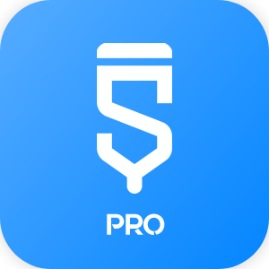

    

# Sketchware Pro
  

Here you'll find the source code of many classes in Sketchware Pro, and most importantly, **the
place** to contribute to Sketchware Pro.

## Building the app

You must use Gradle to build the app. It's highly recommended to use Android Studio, though.

There are two build variants with the same features but slightly different:

 - `MinApi26:` This variant supports exporting AABs from projects. However, it works only on Android 8.0 (O) and above.
 - `MinApi21:` This variant can't produce AABs from projects, but it supports down to Android 5.

You must select the appropriate build variant in Android Studio using the Build Variants tab
or use the appropriate build Gradle command.

### Source code map

| Class | Role |
| ----- | ---- |
| `La/a/a/Dp;` | Helper for compiling an entire project |
| `La/a/a/Ix;` | Responsible for generating AndroidManifest.xml |
| `La/a/a/Jx;` | Generates source code of activities |
| `La/a/a/Lx;` | Generates source code of components, such as listeners, etc. |
| `La/a/a/Ox;` | Responsible for generating XML files of layouts |
| `La/a/a/qq;` | Registry of built-in libraries' dependencies |
| `La/a/a/tq;` | Responsible for the compiling dialog's quizzes |
| `La/a/a/yq;` | Organizes Sketchware projects' file paths |

You can also check the `mod` package that has the majority of contributors' changes.

## Contributing

Fork this repository and contribute back using
[pull requests](https://github.com/Sketchware-Pro/Sketchware-Pro/pulls).

Any contributions, large or small, major features, or bug fixes, are welcomed and appreciated, but will
be thoroughly reviewed.

### How to contribute

- Fork the repository to your GitHub account.
- Make a branch if necessary.
- Clone the forked repository to your local device (optional, you can edit files through GitHub's web interface).
- Make changes to files.
- (IMPORTANT) Test out those changes.
- Create a pull request in this repository.
- The repository members will review your pull request, and merge it when they are accepted.

### What changes we'll (most likely) not accept

Most changes might be UI-related, and we think it's more or less a waste of time. If something design-related gets changed,
ideally the whole app must follow the new style too, and that's hard to accomplish, especially for mods. That's why:

- Major changes to the UI (components which exist in vanilla Sketchware) are unlikely to be accepted.

### Commit message

When you've made changes to one or more files, you have to *commit* that file. You also need a
*message* for that *commit*.

You should read [these guidelines](https://www.freecodecamp.org/news/writing-good-commit-messages-a-practical-guide/), or that summarized:

- Short and detailed.
- Prefix one of these commit types:
   - `feat:` A feature, possibly improving something already existing.
   - `fix:` A fix, for example of a bug.
   - `style:` Feature and updates related to styling.
   - `refactor:` Refactoring a specific section of the codebase.
   - `test:` Everything related to testing.
   - `docs:` Everything related to documentation.
   - `chore:` Code maintenance (you can also use emojis to represent commit types).

Examples:
 - `feat: Speed up compiling with new technique`
 - `fix: Fix crash during launch on certain phones`
 - `refactor: Reformat code at File.java`

## Thanks for contributing
They help keeping Sketchware Pro alive. Each (helpful) accepted contribution will get noted down in the "About Modders" activity. We'll use your GitHub name and profile picture initially, but they can be
changed of course.

## Discord
Wanna chat with us, talk about changes, or just hang out? We have a Discord server just for that.

## Disclaimer
This mod was not meant for any harmful purposes, such as harming Sketchware; Quite the opposite actually.
It was made to keep Sketchware alive by the community for the community. Please use it at your own discretion
and be a Patreon backer of them, for example. Sadly, all other ways to support them aren't working anymore,
so it's the only way available currently.
[Here's their Patreon page.](https://www.patreon.com/sketchware)

We love Sketchware very much, and we are grateful to Sketchware's developers for making such an amazing app, but unfortunately, we haven't received updates for a long time.
That's why we decided to keep Sketchware alive by making this mod, plus we don't demand any money, it's completely free :)
