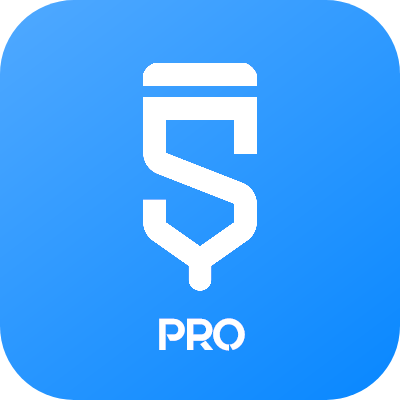

  

# Sketchware Studio

Welcome to Sketchware Pro! Here you'll find the source code of many classes in Sketchware Pro and, most importantly, the place to contribute to Sketchware Pro.

## Building the App
To build the app, you must use Gradle. It's highly recommended to use Android Studio for the best experience.

There are two build variants with different features:

- `minApi26:` This variant supports exporting AABs from projects and compiling Java 1.8, 1.9, 10, and 11 code. However, it only works on Android 8.0 (O) and above.
- `minApi21:` This variant can't produce AABs from projects and can only compile Java 1.7 code, but it supports Android 5 and above .

To select the appropriate build variant in Android Studio, use the Build Variants tab or use the appropriate Gradle build command.

### Source Code Map

| Class           | Role                                        |
| --------------- | ------------------------------------------- |
| `a.a.a.ProjectBuilder`      | Helper for compiling an entire project       |
| `a.a.a.Ix`      | Responsible for generating AndroidManifest.xml |
| `a.a.a.Jx`      | Generates source code of activities          |
| `a.a.a.Lx`      | Generates source code of components, such as listeners, etc. |
| `a.a.a.Ox`      | Responsible for generating XML files of layouts |
| `a.a.a.qq`      | Registry of built-in libraries' dependencies |
| `a.a.a.tq`      | Responsible for the compiling dialog's quizzes |
| `a.a.a.yq`      | Organizes Sketchware projects' file paths    |

> [!TIP]
> You can also check the `mod` package, which contains the majority of contributors' changes.

## Contributing

If you'd like to contribute to Sketchware Pro, follow these steps:

1. Fork this repository.
2. Make changes in your forked repository.
3. Test out those changes.
4. Create a pull request in this repository.
5. Your pull request will be reviewed by the repository members and merged if accepted.

We welcome contributions of any size, whether they are major features or bug fixes, but please note that all contributions will be thoroughly reviewed.

### Commit Message

When you make changes to one or more files, you need to commit those changes with a commit message. Here are some guidelines:

- Keep the commit message short and detailed.
- Use one of these commit types as a prefix:
  - `feat:` for a feature, possibly improving something already existing.
  - `fix:` for a fix, such as a bug fix.
  - `style:` for features and updates related to styling.
  - `refactor:` for refactoring a specific section of the codebase.
  - `test:` for everything related to testing.
  - `docs:` for everything related to documentation.
  - `chore:` for code maintenance (you can also use emojis to represent commit types).

Examples:
- `feat: Speed up compiling with new technique`
- `fix: Fix crash during launch on certain phones`
- `refactor: Reformat code in File.java`

> [!IMPORTANT]
> If you want to add new features that don't require editing other packages other than `pro.sketchware`, make your changes in `pro.sketchware` package, and respect the directories and files structure and names. Also, even though the project compiles just fine with Kotlin classes that you might add, try to make your changes or additions in Java, not Kotlin unless it is more than necessary.

## Thanks for Contributing

Thank you for contributing to Sketchware Pro! Your contributions help keep Sketchware Pro alive. Each accepted contribution will be noted down in the "About Team" activity. We'll use your GitHub name and profile picture initially, but they can be changed, of course.

## Discord

Want to chat with us, discuss changes, or just hang out? We have a Discord server just for that.

## Disclaimer

This mod was not created for any harmful purposes, such as harming Sketchware; quite the opposite, actually. It was made to keep Sketchware alive by the community for the community. Please use it at your own discretion and consider becoming a Patreon backer to support the developers. Unfortunately, other ways to support them are not working anymore, so Patreon is the only available option currently. You can find their Patreon page [here](https://www.patreon.com/sketchware).

We do NOT permit publishing Sketchware Pro as it is, or with modifications, on Play Store or on any other app store. Keep in mind that this project is still a mod. Unauthorized modding of apps is considered illegal and we discourage such behavior.

We love Sketchware very much and are grateful to Sketchware's developers for creating such an amazing app. However, we haven't received updates for a long time. That's why we decided to keep Sketchware alive by creating this mod, and it's completely free. We don't demand any money :)

## Vietnamese 

  

# Sketchware Studio 

Chào mừng bạn đến với Sketchware Pro! Đây là nơi bạn có thể tìm thấy mã nguồn của nhiều lớp trong Sketchware Pro, và quan trọng hơn, là nơi để bạn đóng góp cho Sketchware Pro.

## Xây dựng ứng dụng
Để xây dựng ứng dụng, bạn cần sử dụng Gradle. Rất khuyến khích sử dụng Android Studio để có trải nghiệm tốt nhất.

Có hai biến thể xây dựng với các tính năng khác nhau:

- `minApi26:` Biến thể này hỗ trợ xuất AAB từ các dự án và biên dịch mã Java 1.8, 1.9, 10, và 11. Tuy nhiên, nó chỉ hoạt động trên Android 8.0 (O) trở lên.
- `minApi21:`Biến thể này không thể tạo ra AAB từ các dự án và chỉ có thể biên dịch mã Java 1.7, nhưng hỗ trợ Android 5 trở lên.

Để chọn biến thể xây dựng phù hợp trong Android Studio, sử dụng tab Build Variants hoặc sử dụng lệnh Gradle tương ứng.

### Bản đồ mã nguồn

| Class           | Role                                        |
| --------------- | ------------------------------------------- |
| `a.a.a.ProjectBuilder`      | Hỗ trợ biên dịch toàn bộ dự án       |
| `a.a.a.Ix`      | Phụ trách tạo tệp AndroidManifest.xml |
| `a.a.a.Jx`      | Tạo mã nguồn cho các hoạt động (activities)        |
| `a.a.a.Lx`      | Tạo mã nguồn cho các thành phần như listeners, v.v |
| `a.a.a.Ox`      | Phụ trách tạo các tệp XML của bố cục (layouts) |
| `a.a.a.qq`      | Đăng ký các phụ thuộc của thư viện tích hợp |
| `a.a.a.tq`      | Quản lý câu đố trong hộp thoại biên dịch |
| `a.a.a.yq`      | Tổ chức đường dẫn tệp của các dự án Sketchware    |

> [!TIP]
> Bạn cũng có thể kiểm tra gói `mod`, nơi chứa phần lớn các thay đổi từ cộng đồng.

## Đóng góp

Nếu bạn muốn đóng góp cho Sketchware Pro, hãy làm theo các bước sau:

1. Fork kho lưu trữ này.
2. Thực hiện các thay đổi trong kho lưu trữ đã fork.
3. Kiểm tra các thay đổi đó.
4. Tạo một yêu cầu kéo (pull request) trong kho lưu trữ này.
5. Yêu cầu của bạn sẽ được các thành viên kho lưu trữ xem xét và được chấp nhận nếu hợp lệ.
Chúng tôi chào đón mọi đóng góp, dù lớn hay nhỏ, từ các tính năng chính cho đến sửa lỗi nhỏ, nhưng xin lưu ý rằng tất cả các đóng góp sẽ được xem xét kỹ lưỡng.

### Commit Message

Khi bạn thực hiện thay đổi đối với một hoặc nhiều tệp, bạn cần cam kết các thay đổi đó kèm theo thông điệp cam kết. Dưới đây là một số hướng dẫn:

- Giữ thông điệp cam kết ngắn gọn và chi tiết.
- Sử dụng một trong các loại cam kết sau làm tiền tố:
  - `feat:` cho tính năng mới hoặc cải tiến.
  - `fix:` cho sửa lỗi.
  - `style:` cho các thay đổi liên quan đến giao diện.
  - `refactor:` cho tái cấu trúc mã.
  - `test:` cho các nội dung liên quan đến kiểm thử.
  - `docs:` cho các tài liệu.
  - `chore:` cho bảo trì mã (bạn cũng có thể sử dụng emoji để biểu diễn loại cam kết).

Ví dụ:
- `feat: Speed up compiling with new technique`
- `fix: Fix crash during launch on certain phones`
- `refactor: Reformat code in File.java`

> [!IMPORTANT]
> Nếu bạn muốn thêm các tính năng mới không yêu cầu chỉnh sửa các gói khác ngoài `pro.sketchware`, hãy thực hiện các thay đổi trong gói `pro.sketchware` và tuân thủ cấu trúc thư mục, tệp. Mặc dù dự án có thể biên dịch tốt với các lớp Kotlin mà bạn thêm vào, hãy cố gắng thực hiện các thay đổi hoặc bổ sung bằng Java, trừ khi thực sự cần thiết.

## Cảm ơn bạn đã đóng góp

Cảm ơn bạn đã đóng góp cho Sketchware Pro! Những đóng góp của bạn giúp duy trì sự sống cho Sketchware Pro. Mỗi đóng góp được chấp nhận sẽ được ghi nhận trong mục "About Team" của ứng dụng. Chúng tôi sẽ sử dụng tên GitHub và ảnh đại diện của bạn ban đầu, nhưng tất nhiên, bạn có thể thay đổi.

## Discord

Bạn muốn trò chuyện với chúng tôi, thảo luận về những thay đổi hoặc chỉ muốn giao lưu? Chúng tôi có máy chủ Discord dành riêng cho mục đích đó.

## Tuyên bố miễn trừ trách nhiệm

Bản mod này không được tạo ra với mục đích gây hại cho Sketchware; ngược lại, nó được tạo ra để duy trì Sketchware bởi cộng đồng và cho cộng đồng. Hãy sử dụng nó một cách cẩn thận và cân nhắc trở thành người ủng hộ Patreon để hỗ trợ các nhà phát triển. Thật không may, các phương thức hỗ trợ khác hiện không còn hoạt động, nên Patreon là lựa chọn duy nhất. Bạn có thể tìm thấy trang Patreon của họ tại [đây](https://www.patreon.com/sketchware)..

Chúng tôi KHÔNG cho phép xuất bản Sketchware Pro dưới dạng hiện tại hoặc đã sửa đổi trên Play Store hoặc bất kỳ cửa hàng ứng dụng nào khác. Xin nhớ rằng dự án này vẫn là một bản mod. Việc sửa đổi ứng dụng trái phép bị coi là vi phạm pháp luật, và chúng tôi không khuyến khích hành vi này.

Chúng tôi rất yêu quý Sketchware và biết ơn các nhà phát triển đã tạo ra một ứng dụng tuyệt vời như vậy. Tuy nhiên, đã lâu rồi chúng tôi không nhận được bản cập nhật. Đó là lý do chúng tôi quyết định duy trì Sketchware bằng cách tạo ra bản mod này, và nó hoàn toàn miễn phí. Chúng tôi không yêu cầu tiền. :)

